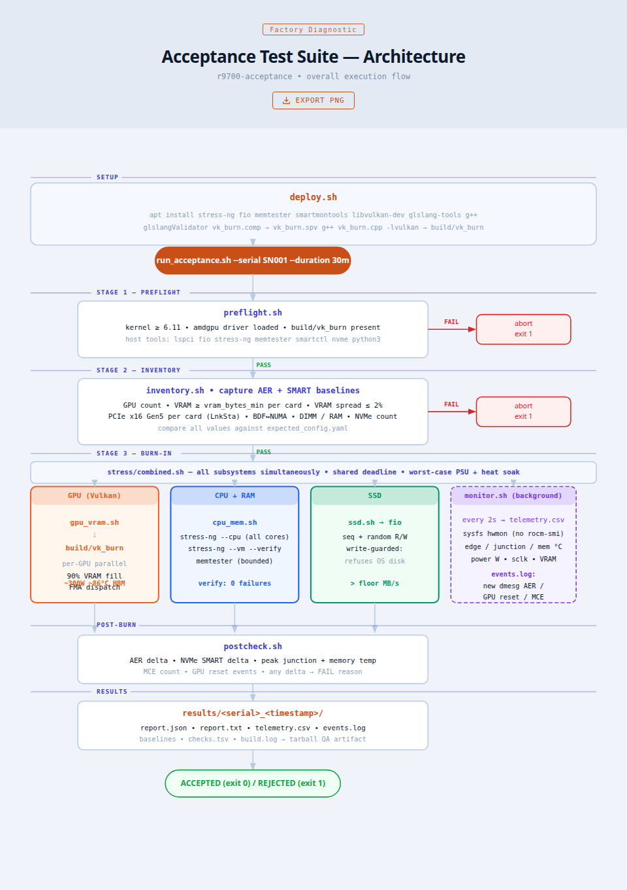

# PROJECT_PLAN.md — `r9700-acceptance`

> 4×R9700 newly-assembled server **acceptance test** suite.
> This document describes the **as-built** architecture. Last revised 2026-07-15.



---

## 1. Goal & Non-Goals

**Goal:** A `git clone`-and-run tool an operator uses on a freshly assembled
4×R9700 server to:
1. Confirm the machine was **assembled correctly** (hardware enumeration, PCIe
   link, VRAM size/uniformity, NUMA mapping).
2. **Burn it in** to confirm stability under sustained load (GPU compute + VRAM,
   CPU, RAM, SSD) at worst-case power/heat.
3. Emit a **machine-readable PASS/FAIL report** tied to a serial number, as a
   shippable QA record.

**This is an acceptance tool, not a lab stress tool.** It faces a stream of
*unknown* new machines and must **catch the bad one** and **fail fast**.

**Non-Goals:**
- No cold-boot / re-enumeration test.
- Not a benchmark/perf-tuning tool (we check against floors/thresholds).
- Does not modify firmware or flash anything.

---

## 2. Core Design Principles (do not violate)

1. **Fail fast, in order.** `preflight → inventory → (abort if either fails) →
  burn-in`. A mis-assembled machine reports *which* check failed in seconds.

2. **No hardcoded skips.** The point of acceptance is to *catch* a bad card.
   Never hardcode skipping any GPU. (The VRAM floor + cross-card spread check
   already caught a card at `0000:e3:00.0` reporting 2 GiB short; it was
   repaired and the four cards now read a uniform 31.86 GiB.)

3. **Compare against an expected config.** All "correctness" checks compare
   observed values against `expected_config.yaml` (GPU count, VRAM, PCIe,
   BDF↔NUMA, RAM, NVMe). Mismatch → FAIL with the offending detail + BDF.

4. **Automated PASS/FAIL.** Every criterion is a programmatic threshold; the
   operator reads `ACCEPTED`/`REJECTED` + a reason list, not a graph.

5. **Self-contained. No ROCm required.** GPU burn-in uses a Vulkan compute
   shader (`src/vk_burn.cpp`) compiled by `deploy.sh` — **no docker, no ROCm,
   no network at runtime**. Only mesa-vulkan-drivers (Ubuntu default) + the
   host packages `deploy.sh` installs are required.

6. **Burn-in runs to a shared deadline,** not a precise countdown. The
   orchestrator sets one deadline; all parallel loads stop together.

7. **Address GPUs by PCI BDF, not index.** Device enumeration order is not
   stable across tools — telemetry and per-card results key on BDF.

8. **Destructive ops are guarded.** Especially `fio` writes — see §8.

9. **Run as root for full coverage.** PCIe LnkSta, NVMe SMART, PCIe AER, and
   the dmesg MCE/reset scan need root; without it they degrade to WARN (never a
   silent skip).

---

## 3. Hardware / Software Target

- **GPUs:** 4× ASRock Radeon AI PRO R9700 (gfx1201 / RDNA4), 32 GB HBM each,
  PCI ID `[1002:7551]`. Reports ~31.86 GiB usable per card.
- **Platform:** WRX90 / WS EVO class board. The dev/golden box enumerates as a
  **single NUMA node** (BIOS NPS1); `expected_config.yaml` reflects that.
- **OS:** Ubuntu 24.04, **kernel ≥ 6.11** (6.8 does **not** enumerate PCI ID
  `1002:7551`; gfx1201 won't appear. `linux-generic-hwe-24.04` is fine).
- **GPU driver:** in-kernel `amdgpu` — requires AMD firmware for gfx1201 (not
  in Ubuntu 24.04 default linux-firmware). Install via `amdgpu-install 7.2.3`
  (driver `30.30.3`): `amdgpu-install --usecase=graphics --no-dkms` (no ROCm,
  no DKMS kernel replacement).
- **No ROCm, no container, no network at runtime.**

---

## 4. Repository Structure

```
r9700-acceptance/
├── README.md
├── deploy.sh                # install host deps + build Vulkan GPU burn binary
├── expected_config.yaml     # golden spec this machine class must match
├── preflight.sh             # Stage 1: go/no-go gate
├── inventory.sh             # Stage 2: enumerate + compare vs expected (+ baselines)
├── run_acceptance.sh        # orchestrator → PASS/FAIL report
├── burn.sh                  # headless server burn-in (no GUI)
├── monitor.sh               # background telemetry logger (CSV) + dmesg event scan
├── lib/
│   ├── common.sh            # logging, PASS/FAIL accumulator, yaml reader, resolve_deadline, BDF helpers
│   ├── thresholds.sh        # all numeric thresholds (no magic numbers in logic)
│   ├── report.sh            # report.json + report.txt + tarball
│   └── postcheck.sh         # post-burn-in deltas: AER, SMART, peak temps, MCE, GPU reset
├── stress/
│   ├── combined.sh          # THE burn-in: GPU Vulkan + CPU/RAM + SSD simultaneously, shared deadline
│   ├── gpu_vram.sh          # Vulkan VRAM/compute burn (used by combined; per-GPU parallel)
│   ├── cpu_mem.sh           # stress-ng (CPU + RAM) + bounded memtester
│   ├── ssd.sh               # fio read/write WITH write-safety guard
│   └── llm_bench.sh         # optional: per-card LLM tokens/sec benchmark
├── src/
│   ├── vk_burn.cpp          # Vulkan compute GPU burn (VRAM fill + FMA)
│   └── vk_burn.comp         # GLSL compute shader for vk_burn
├── gui/
│   ├── main.py              # PyQt6 app entry point
│   ├── sensors.py           # unified sensor reader (sysfs hwmon, no rocm-smi)
│   ├── burnin.py            # burn-in orchestration for GUI
│   ├── pages/               # Stability Test, Monitoring, AI Model pages
│   └── widgets/             # sidebar, topbar
└── results/
    └── <serial>_<timestamp>/  # runtime: telemetry.csv, events.log, baselines, report.{json,txt}, tarball
```

---

## 5. `expected_config.yaml` (schema)

Operator fills this per machine class. `inventory.sh` compares against it.
Key fields (see the file for the full, commented version):

```yaml
machine_class: "ASRock-4xR9700-dev"
gpu:
  count: 4
  pci_id: "1002:7551"
  vram_gb_each: 32
  vram_bytes_min: 33500000000   # per-card floor (catches a short card)
  vram_spread_max_frac: 0.02    # cross-card uniformity (catches the odd card out)
  vram_burn_pct: 90             # Vulkan VRAM-fill target during burn-in
  pcie_link_width: 16           # x16
  pcie_link_speed: "32GT/s"     # Gen5
  vram_ecc_enabled: false       # intended fleet ECC policy
  topology: [ {bdf, numa_node}, ... ]
cpu:    { numa_nodes: 1 }       # single-NUMA on this box
memory: { dimm_count: 0, total_gb_min: 180 }   # dimm_count 0 = skip (needs root)
storage:{ nvme_count: 1 }
kernel: { min_version: "6.11" }
```

`serial` is **not** here — it's per-unit, passed at runtime (`--serial`).

---

## 6. Stages

### Stage 1 — `preflight.sh` (go/no-go)
Blocks environment problems before wasting a burn-in. Each check prints the
problem **and the fix**, exits non-zero on failure.
- Kernel ≥ `kernel.min_version`.
- `amdgpu` driver loaded; GPU(s) visible to Vulkan.
- `build/vk_burn` binary present (built by `deploy.sh`).
- Required host tools: `lspci, fio, stress-ng, memtester, smartctl, nvme,
  sensors, dmidecode, python3` + PyYAML. `ipmitool`/`mcelog` warn-only.
  (`git` is **not** required at runtime — not in the preflight check list.)

### Stage 2 — `inventory.sh` (enumerate + compare; captures baselines)
- **GPU count** == expected (`lspci -d 1002:7551`).
- **VRAM per card** ≥ `vram_bytes_min`, **and** cross-card spread ≤
  `vram_spread_max_frac`. *This pair catches a short/odd card.*
- **PCIe link width/speed** per card vs expected (LnkSta, needs root).
- **BDF↔NUMA** mapping (informational when `numa_nodes == 1`).
- **VRAM ECC consistency** across the 4 cards (WARN if RAS reporting is off).
- **DIMM / total RAM** ≥ expected (DIMM needs root; RAM from /proc/meminfo).
- **NVMe count** == expected.
- Captures **AER** + **NVMe SMART** baselines for the post-burn-in delta.

### Stage 3 — `stress/combined.sh` (burn-in, ONE stage, all subsystems at once)
Runs for `--duration` with everything loaded simultaneously, sharing one
deadline — the worst case (PSU peak + heat soak) while VRAM is occupied:
- **GPU:** `gpu_vram.sh` → `build/vk_burn` (Vulkan compute, fill 90% VRAM +
  FMA dispatch). Per-GPU parallel; ~29.5 GB VRAM occupied, ~300 W, memory
  ~86 °C. Verified by watching power + VRAM-used across all cards, keyed by BDF.
- **CPU + RAM:** `cpu_mem.sh` → `stress-ng --cpu` + `stress-ng --vm --verify`
  across all cores/channels, plus `memtester` (bounded by `timeout`).
- **SSD:** `ssd.sh` → `fio` random+sequential R/W, write-guarded (see §8).

---

## 7. `monitor.sh` (background telemetry)
Polls every 2 s during burn-in → `results/<...>/telemetry.csv`:
`timestamp, gpu_id, bdf, junction_temp, memory_temp, edge_temp, power_draw_w,
vram_used_mb, vram_total_mb, gpu_clock_mhz, mem_clock_mhz, throttle_status,
ecc_total, nvme_temp, fan_rpm, chassis_power_w`. Unsupported fields → `N/A`.

All GPU sensors read from **sysfs hwmon** (`/sys/class/hwmon/hwmonN/` where
`name == "amdgpu"`). No rocm-smi dependency.

Plus `events.log`: scans **new** dmesg lines (cursor baselined at start, so boot
history isn't flagged) for real `AER:` / `PCIe Bus Error` / `Machine check` /
`amdgpu ... reset` / `GPU reset` lines.

`postcheck.sh` re-captures and **deltas** vs Stage-2 baselines: AER counters,
NVMe SMART (reallocated/media). Also judges peak junction/memory temps and
counts MCE / GPU-reset events. Any new error or over-threshold temp → FAIL.

---

## 8. Safety (mandatory guards)

**fio write guard — can destroy the OS disk if wrong.**
- `ssd.sh` **refuses** to write to any device hosting a mounted filesystem
  (resolves the root device and rejects it / any mounted block device).
- Defaults to **file-based** testing (`results/fio_test.tmp`, cleaned up). Never
  defaults to a raw device; a raw target must be explicitly named, unmounted,
  and not the OS disk.

**General:** every stress process/child is tracked by PID and killed on duration
end, Ctrl-C, or error (`trap cleanup_tracked EXIT INT TERM`). No orphans.

---

## 9. PASS/FAIL Criteria (all automated)

| Check | PASS condition | Stage |
|---|---|---|
| GPU count | == expected (4) | inventory |
| VRAM per card | ≥ `vram_bytes_min` on every card | inventory |
| VRAM uniformity | cross-card spread ≤ `vram_spread_max_frac` | inventory |
| PCIe link (per card) | negotiated x16 Gen5 (LnkSta) — *root* | inventory |
| VRAM ECC | same mode on all cards (WARN if RAS off) | inventory |
| BDF↔NUMA | matches expected (auto-pass if single node) | inventory |
| DIMM / RAM | count & total ≥ expected | inventory |
| NVMe count | == expected | inventory |
| GPU loaded | each card pulls full power + fills VRAM | burn-in |
| Junction temp | peak < `GPU_JUNCTION_FAIL_C` | postcheck |
| Memory temp | peak < `GPU_MEMORY_FAIL_C` | postcheck |
| AER delta | 0 new correctable/nonfatal — *root* | postcheck |
| MCE / GPU reset | none during burn-in — *root* | postcheck |
| NVMe SMART delta | no new reallocated/media — *root* | postcheck |
| fio bandwidth | > floor (`thresholds.sh`) | burn-in |
| CPU/RAM verify | stress-ng `failed: 0`, memtester no FAILURE | burn-in |

Thresholds centralized in `lib/thresholds.sh`.

---

## 10. `run_acceptance.sh` (orchestrator)

**Args:** `--serial <S>` (required), `--config`, `--duration <30m>` (the burn-in
length — single combined stage), `--mode {full|preflight|inventory|burnin}`,
`--fio-target <path>`.

**Flow:**
1. Create `results/<serial>_<timestamp>/`.
2. `preflight.sh` → on fail, write report, **abort**.
3. `inventory.sh` (capture baselines) → on fail, write report, **abort**.
4. Start `monitor.sh`.
5. `stress/combined.sh` for `--duration` (GPU+CPU+SSD at once, shared deadline).
6. Stop monitor; `postcheck.sh` (AER/SMART deltas, peak temps, MCE/reset).
7. `report.json` + `report.txt`: per-check PASS/FAIL, peak junction/memory temp,
   avg/peak power, events, top-line **ACCEPTED / REJECTED**.
8. Tarball the results dir as the QA artifact.

---

## 11. GUI (`gui/`)

PyQt6 desktop app (`sudo -E python3 gui/main.py`). Three pages:
- **Stability Test** — Light/Full mode, component selection (GPU/CPU/SSD),
  start/stop, live timer. Calls `burnin.py` which drives the stress scripts.
- **Monitoring** — per-sensor checkbox + individual real-time chart cards.
  Reads sysfs hwmon directly (edge/junction/memory temp, power, sclk, VRAM).
- **AI Model** — LLM inference benchmark, per-card tokens/sec. Requires
  `deploy.sh --with-llm` and a `.gguf` model in `models/`. Recommended:
  Qwen2.5-7B-Instruct-Q4_K_M (no HF token, Apache 2.0) or
  Llama-3.1-8B-Instruct-Q4_K_M (needs HF token + Meta license).
  Download via `hf download bartowski/<repo> --local-dir models/`.

`sudo -E` is required: the burn-in mounts the NVMe fio target which needs root;
`-E` preserves `DISPLAY`/`XAUTHORITY`/`XDG_RUNTIME_DIR` for the window.

---

## 12. Not implemented / future work

- **Interconnect (rccl) test.** Inter-GPU P2P is fully supported on this
  platform (full mesh `hipDeviceCanAccessPeer`), but a self-contained P2P
  bandwidth burn is not yet bundled.
- **Per-class production config.** `expected_config.yaml` currently reflects the
  single-NUMA dev box; re-tune the `# TUNE` lines (NUMA, RAM, NVMe, PCIe) for
  the production WRX90 class before shipping.

---

## 13. Known Environment Gotchas (encoded — don't rediscover)

- **Kernel 6.8 won't enumerate gfx1201** (`1002:7551`). Require ≥ 6.11.
- **AMD firmware required for gfx1201.** Not included in Ubuntu 24.04 default
  linux-firmware. Install via `amdgpu-install --usecase=graphics --no-dkms`
  (no DKMS kernel replacement, no ROCm — in-kernel amdgpu is sufficient once
  firmware is present).
- **PCIe down-negotiation is invisible to GPU tools** — a card at x8/Gen3 passes
  every functional GPU test at half bandwidth. Only `lspci -vvv` LnkSta catches
  it (needs root). Don't skip it.
- **System RAM is invisible to GPU stress** — needs its own `stress-ng --vm` /
  `memtester`. `memtester` ignores any duration (one pass ≈ 20 patterns over the
  whole region, 10+ min) — it MUST be wrapped in `timeout`.
- **`mcelog` is gone from Ubuntu 24.04 (noble)** — MCE detection falls back to
  scanning dmesg for `Machine check`.
- **`deploy.sh` installs packages one-by-one** so one unavailable package doesn't
  abort the whole apt transaction.
- **fio is a footgun** — see §8. The one mistake that ruins a customer machine.
- **Run as root** for PCIe LnkSta, SMART, AER, and dmesg MCE/reset coverage.
- **Vulkan device name matters.** Without the AMD driver installed, `vk_burn
  --list` may enumerate a discrete GPU (type=2) but its name won't contain
  "R9700". Both `deploy.sh` sanity check and `gpu_vram.sh` filter by name —
  if the driver isn't loaded, the GPU is invisible to the burn and results in
  a FAIL check (not a silent pass). `deploy.sh` warns with the exact install
  commands.
- **Zero checks recorded → force REJECTED.** If `checks.tsv` is empty after
  the run (e.g., vk_burn wasn't built, stages didn't run), `run_acceptance.sh`
  forces `REJECTED` instead of emitting a spurious `ACCEPTED`.
- **`lib/*.sh` must be executable.** `deploy.sh` chmods `*.sh`, `stress/*.sh`,
  and `lib/*.sh`; a fresh clone without chmod will fail with "permission denied"
  on `postcheck.sh` (which would silently skip temp/AER delta checks).
- **LLM model is not bundled.** `llm_bench.sh` requires a `.gguf` in `models/`.
  Qwen2.5-7B Q4_K_M (~5 GB) needs no HF token. Llama 3.1 8B Q4_K_M (~5 GB)
  requires `hf login` (Meta license gate). See README §LLM for
  exact download commands.
